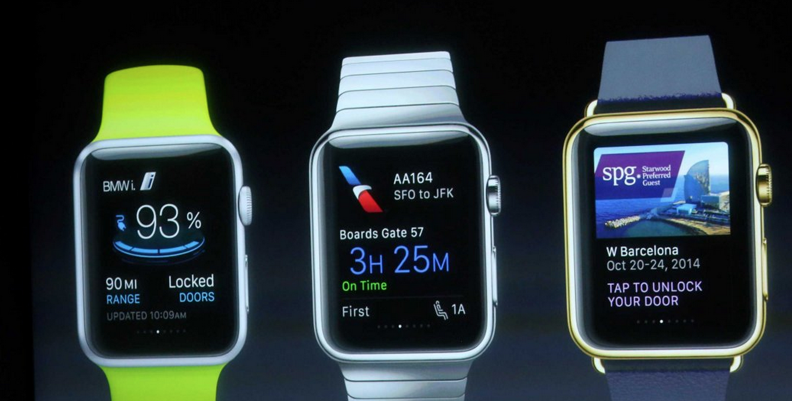
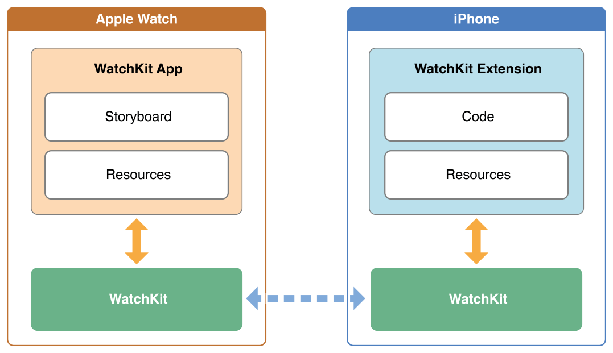
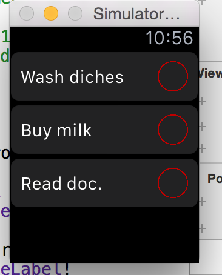
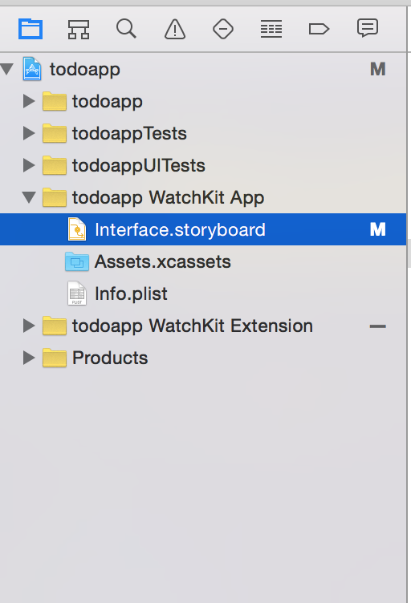
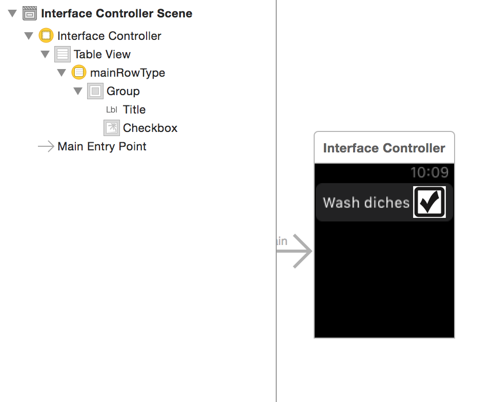
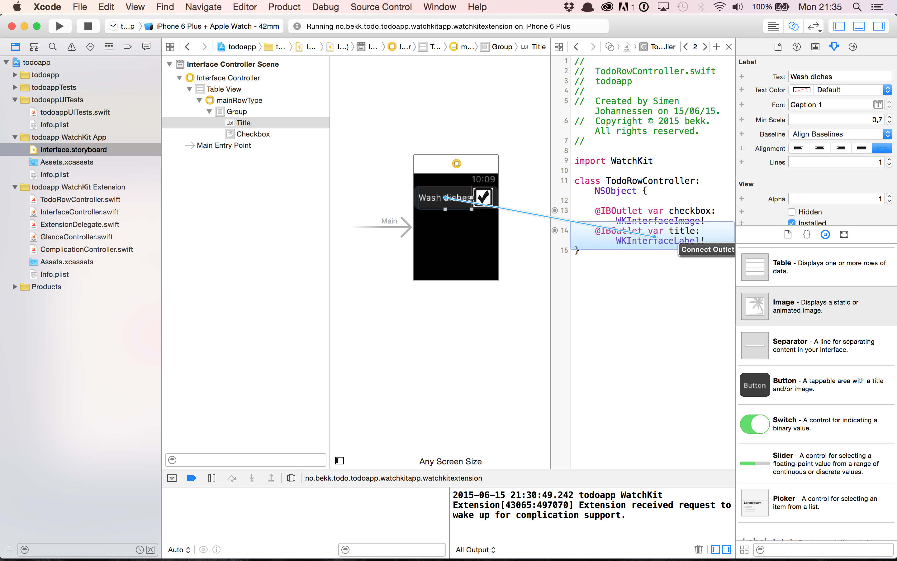

# Apple Watch workshop

---

# Apple Watch


- Lansert 24. april i Australia, Canada, China, France, Germany, Hong Kong, Japan, UK & USA
- Krever iPhone for å kjøre 3-partsapps
- Følger mange av de samme design patterns som for vanlig iOS-utvikling

---

- Klokkebank for Apple Watch & Pebble


---



---

# Apps

- Hieraktisk eller page-based


---

# Notifications

- Out of the box -støtte 
- iPhone bestemmer om notifikasjon vises på klokke eller mobil
- Action buttons

---

# Glance

- “A glance is a focused interface that you use to display your app’s most important information.” (developer.apple.com)

---


---
# Arkitektur



---

# Kommunikasjon

- Shared app group
	- NSUserDefaults eller filer

```swift
if let userDefaults = NSUserDefaults(suiteName: "group.com.example.myAppGroup") {
    userDefaults.setObject("test", forKey: "test")
}
```

---

# Kommunikasjon

- Direkte via closures syntax
	- Open Parent Application
	- AppDelegate får request og responderer

```swift
if let userDefaults = NSUserDefaults(suiteName: "group.com.example.myAppGroup") {
    userDefaults.setObject("test", forKey: "test")
}
```


---

# Watch OS 2

- Native apps


- Nye tilganger som haptic feedback, digital crown, sensors via HealthKit

---

- Complications via ClockKit framework


---

# Resources
- https://developer.apple.com/watch/human-interface-guidelines/
- https://developer.apple.com/library/ios/documentation/General/Conceptual/WatchKitProgrammingGuide/index.html

---

# Oppgaver 

- Todo-app for Apple Watch

--- 

# Prosjekt

Oppsett følg guide

https://developer.apple.com/library/ios/documentation/General/Conceptual/WatchKitProgrammingGuide/ConfiguringYourXcodeProject.html


eller last ned boilerplate prosjekt:

git@github.com:Lomaas/boilerplate.git

---

# Vis todo's



https://developer.apple.com/library/ios/documentation/General/Conceptual/WatchKitProgrammingGuide/Tables.html

---

# Start

- Start i Interface.storyboard hvor grensesnittet defineres
- Dra inn tableView



- Konfiguer table row etter ønske. F. eks en tittel label, dato label og et bilde


---

# TableView - storyboard


 

- Husk å sette identifier string og custom klasse for TableRowController

---

# Custom row



ctrl-click label og drag inn i TodoRowController
 
---

# Configure TableView

1. Create some fake data
2. Set number of rows and configure each row controller

```swift
tableView.setNumberOfRows..
let row = tableView.rowControllerAtIndex...
```

---

# Complete task

- Implementer

```swift
   func table(_ table: WKInterfaceTable, didSelectRowAtIndex rowIndex: Int)
```

---

# Legg til force touch

- Legg til ny todo når bruker longpresser


---

# Complication

- Legg til todo som er kortest til basert på dato som complication (komponent på watchface)
- Bonus støtt timeline.  
- https://developer.apple.com/library/prerelease/watchos/documentation/ClockKit/Reference/ClockKit_framework/index.html


---