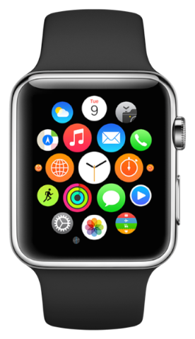

# Apple Watch workshop

---

# Apple Watch



- Lansert 24. april i Australia, Canada, China, France, Germany, Hong Kong, Japan, UK & USA
- Følger mange av de samme design patterns som for vanlig iOS-utvikling

---

- Klokkebank for Apple Watch


---

# Komponenter

- Apps, notifikasjoner, glance, complication

---

# Apps

- Hieraktisk eller page-based


---

# Notifications

- Out of the box -støtte 
- iPhone bestemmer om notifikasjon vises på klokke eller mobil
- Action buttons

---

# Glance

- “A glance is a focused interface that you use to display your app’s most important information.” (developer.apple.com)
- OnClick launch app


---

# Complications via ClockKit framework


---


---

# Arkitektur


---

# Watch OS2


---

# Watch OS2

- Native apps


- Nye tilganger som haptic feedback, digital crown, sensors via HealthKit

---	

# DEPRECATED

- Shared app group
	- NSUserDefaults eller filer
- iOS frameworks som f.eks CloudKit
- https://developer.apple.com/library/prerelease/watchos/documentation/General/Conceptual/AppleWatch2TransitionGuide/index.html

---

# Kommunikasjon

- Direkte via closures syntax
	- Open Parent Application
	- AppDelegate får request og responderer
- Watch Connectivity framework

```swift

```


---


# Resources
- https://developer.apple.com/watch/human-interface-guidelines/
- https://developer.apple.com/library/ios/documentation/General/Conceptual/WatchKitProgrammingGuide/index.html

---

# Oppgaver 

- Todo-app for Apple Watch

--- 

# Prosjekt

Oppsett følg guide

https://developer.apple.com/library/ios/documentation/General/Conceptual/WatchKitProgrammingGuide/ConfiguringYourXcodeProject.html


eller last ned boilerplate prosjekt:

https://github.com/Lomaas/applewatch

